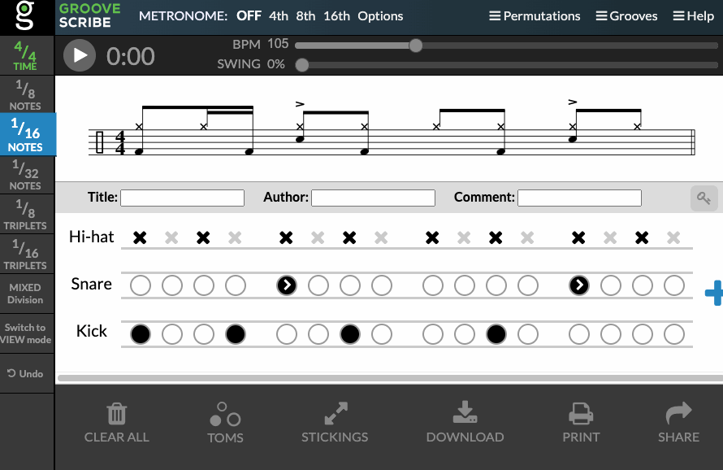

# README #

A barebone fork of GrooveScribe for embedding drum sheet notation in
[Notion](https://www.notion.so/).

GrooveScribe is a visual tool for musicians to annotate their drum grooves and
fills. It is accessible at https://www.mikeslessons.com/gscribe or
http://montulli.github.io/GrooveScribe/.

The original GrooveScribe project source code is at
https://github.com/montulli/GrooveScribe.

#### How to use:

1. Transcribe your drum groove or fill at one of the URLs listed above.

2. Copy the link.

3. Use the [converter](https://sonph.github.io/notion-drum-sheet/convert.html)
to convert the URL to an embeddable link.

4. Embed the link in Notion with `/embed` and pasting the link.

#### Demo:

#### Changes:

1. Make `GrooveEmbed.html` the default `index.html`.

2. Remove included javascript related to MIDI, sounds, sharing, etc. You can
still click on the notation to be linked to the full GrooveScribe page where
you can edit the notation and play it.

3. An utility to convert a `https://www.mikeslessons.com/groove` link to an
embeddable link: https://sonph.github.io/notion-drum-sheet/convert.html

4. Add a HTML query string to display tempo and time signature with the
notation. To use this, add `&EmbedTempoTimeSig=true` to the end of the URL.
