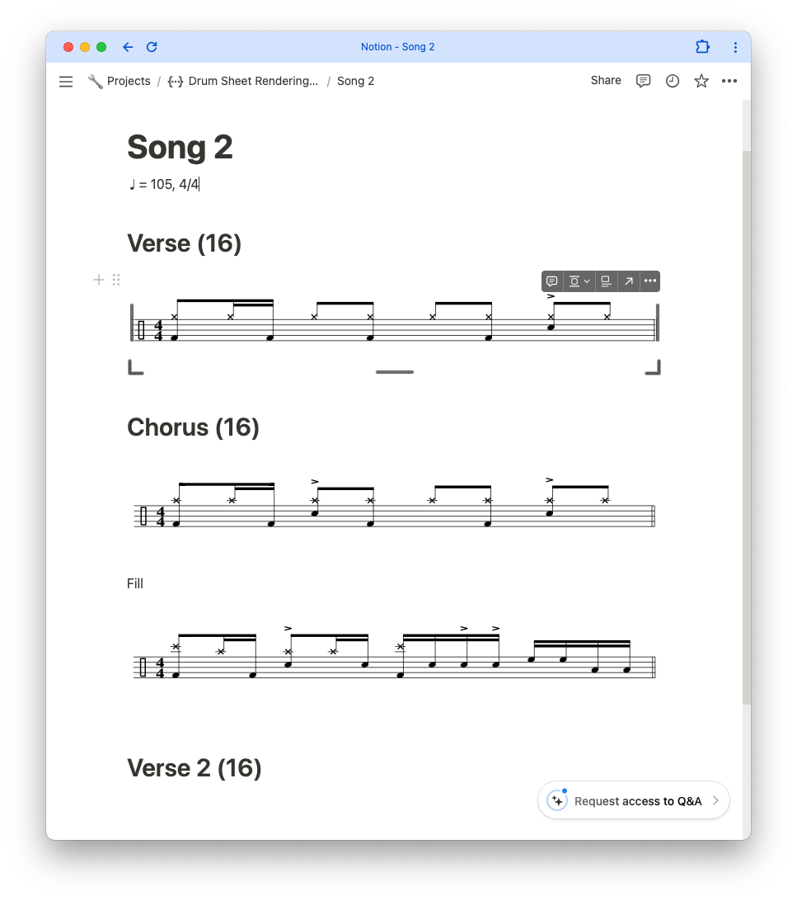
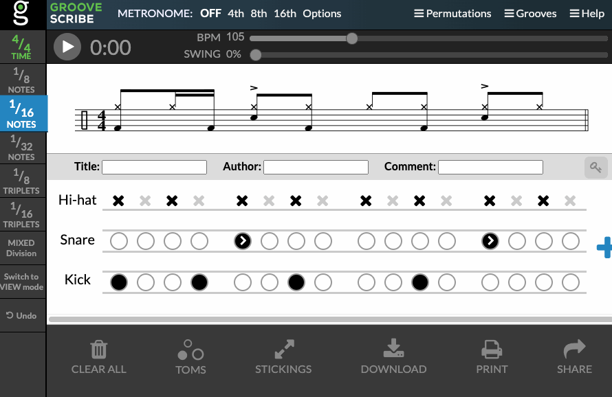

# Embedding Drum Notation in Notion

A barebone fork of GrooveScribe for embedding drum sheet notation in
[Notion](https://www.notion.so/).

**GrooveScribe**
GrooveScribe is a visual tool for musicians to annotate their drum grooves and
fills.



## How to use:

1. Go to https://montulli.github.io/GrooveScribe or https://sonph.github.io/GrooveScribe and transcribe your drum groove or fill.

2. Copy the URL.

3. Use the [converter](https://sonph.github.io/notion-drum-sheet/index.html)
to convert the copied URL into an embeddable link. Copy this converted link.

4. In Notion, insert an embed block with `/embed` then paste the link.

Clicking on the embedded notation will take you to the original GrooveScribe page
where you can edit and play it.

## Demo



## FAQ

<details>
<summary>What does the "show tempo" box on the converter page do?</summary>
Check the "show tempo" box if you want to show the tempo and time signature
with the embedded notation.

This is useful if you collect different grooves and fills at different tempos
and time signatures.
    
Don't check it if the grooves and fills belong in the same song that plays at
a consistent tempo.
</details>

## Changes:

1. Make `GrooveEmbed.html` -> `render.html`.

2. Remove all included javascript and assets related to MIDI, sounds, sharing,
etc. You can still click on the notation to be linked to the full GrooveScribe
page where you can edit the notation and hear it.

3. An utility to convert a `https://www.mikeslessons.com/groove` link to an
embeddable link: https://sonpham.me/notion-drum-sheet.

4. Add a HTML query string to display tempo and time signature with the
notation. To use this, add `&EmbedTempoTimeSig=true` to the end of the URL.

## Development

1. Start a Python server:

```
python3 -m http.server
```

2. In a browser, open http://localhost:8000/
